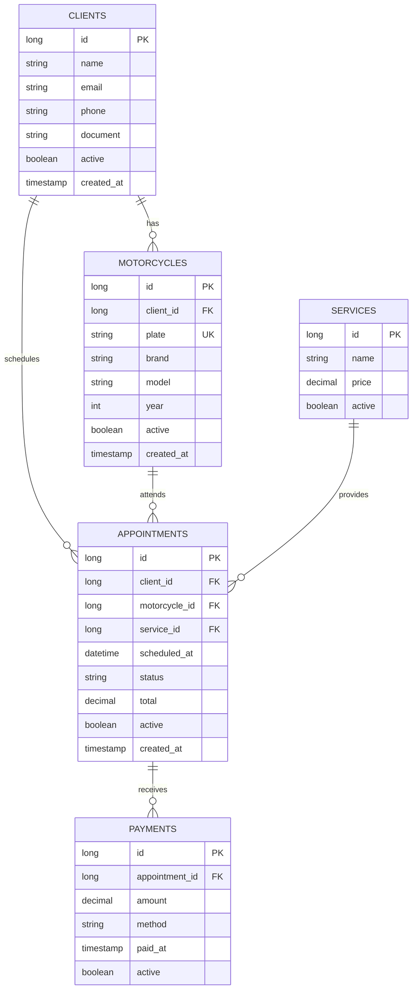

# Diagrama Entidad-Relación — MotoCitas

## Mermaid ER Diagram



## Descripción de Entidades

### CLIENTS (Clientes)
- Almacena información de los clientes del taller
- Cada cliente puede tener múltiples motocicletas
- Cada cliente puede agendar múltiples citas
- Borrado lógico mediante campo `active`

### MOTORCYCLES (Motocicletas)
- Asociadas a un cliente específico
- Identificadas por placa única
- Pueden tener múltiples citas
- Información: Marca, Modelo, Año

### SERVICES (Servicios)
- Catálogo de servicios disponibles en el taller
- Cada servicio tiene un precio
- Puede estar asociado a múltiples citas
- Ejemplos: Cambio de aceite, Reparación de frenos, etc.

### APPOINTMENTS (Citas)
- Asocia un cliente, una motocicleta y un servicio
- Programadas en una fecha/hora específica
- Estados: PENDING, COMPLETED, CANCELED
- Total calculado automáticamente desde el precio del servicio
- Registra cuándo se creó la cita

### PAYMENTS (Pagos)
- Registra pagos de citas completadas
- Asociado a una cita específica
- Incluye: Monto, Método de pago (CASH, CARD, TRANSFER)
- Registra fecha de pago
- Borrado lógico disponible

## Relaciones

### Cliente → Motocicleta (1:N)
- Un cliente puede tener múltiples motocicletas
- Una motocicleta pertenece a un único cliente

### Motocicleta → Cita (1:N)
- Una motocicleta puede tener múltiples citas
- Una cita es para una única motocicleta

### Cliente → Cita (1:N)
- Un cliente puede agendar múltiples citas
- Una cita es agendada por un único cliente

### Servicio → Cita (1:N)
- Un servicio puede asociarse a múltiples citas
- Una cita solicita un único servicio

### Cita → Pago (1:N)
- Una cita puede tener múltiples pagos (pagos parciales)
- Un pago está asociado a una única cita

## Índices

```sql
CREATE INDEX idx_motorcycles_client_id ON motorcycles(client_id);
CREATE INDEX idx_motorcycles_plate ON motorcycles(plate);
CREATE INDEX idx_appointments_client_id ON appointments(client_id);
CREATE INDEX idx_appointments_motorcycle_id ON appointments(motorcycle_id);
CREATE INDEX idx_appointments_scheduled_at ON appointments(scheduled_at);
CREATE INDEX idx_payments_appointment_id ON payments(appointment_id);
```

## Restricciones

- **Clave Primaria**: Cada tabla tiene un `id` autoincremental
- **Claves Foráneas**: Integridad referencial en todas las relaciones
- **Unique**: `motorcycles.plate` debe ser único
- **Default**: `active = true` para todas las entidades
- **Not Null**: Campos obligatorios en cada tabla

---

**Diagrama versión 1.0**
